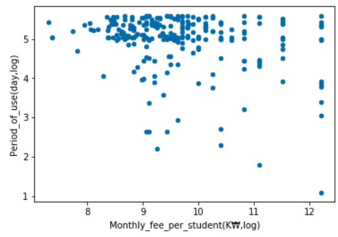

### 초기비용의 차이가 이탈률/유지기간에 영향을 주는가?

- Data

  - 대상 : 4/1~8/1 가입자 ( 가입자 또는 해지자 )

  - 정의
  
      | 요소     | 정의                                                         |
      | -------- | ------------------------------------------------------------ |
      | 이탈     | 가입기준 120일(4개월) 이내 탈퇴                              |
      | 유지기간 | 사용일수 (단, 120일 초과시 120일로 고정)                     |
      | 초기비용 | 가입비+월 사용요금                                           |
      | 가입요금 | 가입비용(단,재가입자와 요금제 전환자의 가입비는 0임.)        |
      | 기기구매 | 추가구매 가능                                                |
      | 정기구독료   | 월 사용요금(추가과금 별도) *다양한 구독료 존재(스타터,학부모, 지인) |
      | 기대수익(LTV)   | 4개월치 월사용요금/ 4개월내 이탈률 |

- How

  - 이탈률(logit) , 유지기간(OLS) , 집단차이(T-test )

- Result

  - 1] 고객군 비교분석한 결과, 가입비가 높으면 비교군 대비 이탈률과 LTV가 1.7배 차이가 난다. 이는 매우 단순한 분석이므로 단순히 초기비용을 올리자! 라는 식의 의사결정을 내 릴 수 없다. 가입비가 아까워서 유지기간이 길어지는 것인가? 가격에 대한 분석을 더 해보았다. "상관분석와 이탈률/유지기간 모형"을 통해 세부설명을 확인하자.

    - [자료1-1] 기술통계량 

      | 가입비 구간   | 학원수(개) | 이탈률(%) | 유지기간(일) | LTV(천원) |
      | ----------- | ---------- | --------- | ------------ | --------- |
      | 20만원 이하 | 110        | 27.2      | 104          | 2,729     |
      | 20만원 초과 | 130        | 16.9      | 111          | 4,680     |

      - 월 사용요금 : 19만 8천원에 집중 분포되어 있어 구간별 분석 불가능.

    - [자료1-2] 군집비교 : 가입비 일반고객 vs 가입비 할인/무료 고객

      | 고객군  | 이탈률(%) | 유지기간 |
      | ------- | --------- | -------- |
      | t-stat  | -1.918    | 4.377    |
      | P-value | 0.05      | 0.0000   |

  - 2] 이탈률을 기준으로 Logit Regression 을, 유지기간을 기준으로 OLS Rregression을 활용한 결과(유의수준 0.05기준), 이탈률 상승과 유지기간 감소에 유의미한 영향을 끼치는 요소로 전자는 "태블릿비", 후자는 "태블릿비, 학생당 월 정기사용료"로 나타났다. 여기서 "학생당 월 정기사용료"에 주목하자. **상관계수**에서 "학생당 월 정기사용료"는 가격요소 및 학원규모(학생수) 중 이탈률/유지기간에 가장 큰 영향을 미치는 요소로 *이탈률과 20% 비례관계, 유지기간과 25% 반비례관계*이다.  **회귀모델**에서 *월 사용료(단위: 천원)가 1% 오를 때마다 고객은 18%만큼 유지기간이 짧아지는 가격탄력성*을 보여준다.  **기술통계량**비교시, *이탈률과 LTV가 1.5배* 차이난다. 이는 실제 이탈사유 2순위였던 가격 또는 "실질 수입 대비 지출"으로 해석가능하다. `태블릿비`는 정제가 덜 된 데이터이기 때문에 추가 정제작업을 한 뒤에 실제 유의한 것인지, 왜 유의한 것인지 인과관계를 파악해야한다는 숙제가 남아있다.

    - [자료 2-1] 상관관계 : 각 요소와 이탈률/유지기간 간의 **상관계수**를 보면 학생당 월 정기사용료의 절대값이 가장 높다.

      | 상관계수(요소별)     | 이탈률         | 유지기간        |
      | -------------------- | -------------- | --------------- |
      | 태블릿비             | -0.160743      | 0.226394        |
      | 가입비               | -0.113163      | 0.111747        |
      | 월 정기사용료        | 0.026116       | -0.072670       |
      | 학생수               | -0.175324      | 0.172381        |
      | 학생당 월 정기사용료 | 0.196367 `max` | -0.240963 `min` |

    - [자료 2-2] 기술통계량

      | 학생당 구독료 구간        | 학원수(개) | 이탈률(%) | 유지기간(일) | LTV(천원) |
      | ----------- | ---------- | --------- | ------------ | --------- |
      | 13천원 미만 | 125        | 17.6      | 110          | 4,401     |
      | 13천원 이상 | 114         | 26.3      | 105           | 2,921     |
    - scatter plot ( Monthly_fee_per_student(K₩,log)','Period_of_use_in4month(day,log)' )
      

### 무료체험기간의 차이가 이탈률/유지기간에 영향을 주는가?

- Data
    | 전제            | 무료체험기간 5일 이상, 30일 이하                             |
    | --------------- | ------------------------------------------------------------ |
    | 가입률          | 조건1) 19/3/1~8/1 무료체험시작 조건2) 12/31 이전 체험종료  |
    | 이탈률/유지기간 | 조건1) 19/3/1~8/1 무료체험시작  조건2) 12/31 이전 체험종료  조건3) 가입한 이력 존재 |

  - 나머지 정의 : 상동

    

- Design of expr.

  - [초기]무료체험2배 ( 9/16 ~ 9/30) vs 무료체험 (8/14~8/26) vs 무료체험(10/16~30) 
    - 가입전환율
    - 2달이내 이탈률 
    - 2달이내 평균유지기간)
    - 변경사유) 원인미상의 다양한 무료체험기간이 존재함
  - [대체]실험설계
    - 가입전환율
    - 4달이내 이탈률
    - 4달이내 평균유지기간

- How : 상동

- Result 

  - 1] 무료체험기간이 길면 가입할 가능성은 매우 높으며 이탈율이 낮거나 유지기간이 길 가능성 알 수없음. 그러나 . 왜냐하면 가입율은 약 1.7배(=566/333)로 높지만 이탈률은 22%~23%로 비슷한 수준이기 때문이다. 실제 상관계수를 확인해도 무료체험기간과 가장 상관성이 높은 것은 가입율 뿐이다. 무료체험기간 11일을 기준으로 고객군을 나눠 통계실험(유의수준5%)을 해보아도 가입률은 매우 유의한 수준에서 관련성이 있음이 증명되지만, 이탈률과 유지기간은 그렇지 않다. 실제 이탈자 설문조사 결과에서도 무료체험기간은 이탈 원인으로 언급되지 않는다.

    - [자료1-1] 기술통계량

      | 무료체험기간 | 학원수(개) | 가입율(%) | 가입자(명) | 이탈률(%) | 유지기간(일) |
      | ------------ | ---------- | --------- | ---------- | --------- | ------------ |
      | 11일 이하    | 758        | 33.3      | 253        | 21.7      | 107          |
      | 11일 초과    | 60         | 56.6      | 34         | 23.5      | 107          |

    - [자료1-2] 상관관계 : 가입율 외엔 연관성 1도 없어 보임. 실제 scatter plot 역시 패턴 안 보임.

      | 상관계수     | 가입율 | 이탈율 | 유지기간 |
      | ------------ | ------ | ------ | -------- |
      | 무료체험기간 | 0.139  | 0.015  | 0.009    |

    - [자료1-3] 군집비교 : 무료체험기간 5~11일 vs 11일초과

      | 고객군  | 이탈률 | 유지기간 | 가입률 |
      | ------- | ------ | -------- | ------ |
      | t-stat  | -0.228 | 0.014    | -3.48  |
      | P-value | 0.8    | 0.9      | 0.000  |

      

- Next mov.

  - how about binarizing monthly fees ?
    - 이유 : 학생당 월 사용요금이 서비스 유지에 유의한 관계를 보이기 때문.
    - 이슈 : 학생수를 고려하여 이분화된 요금제 도입시, 매출액의 감소가 발생하는지 파악하기.
    - 목표 : 신규 소득의 증가분 vs 기존 소득의 감소분 비교하기
    - 방법 : 초기 init setting에서의 학원규모 정보를 활용하라.

  
